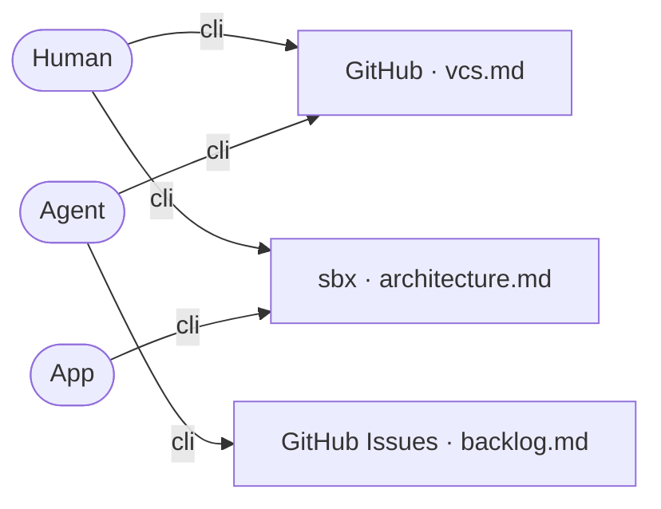

# Ecosystem

```mermaid
flowchart LR
  Human([Human])
  Agent([Agent])
  App([App])
  GitHub["GitHub · vcs.md"]
  Issues["GitHub Issues · backlog.md"]
  Sbx["sbx · architecture.md"]

  Human -- cli --> GitHub
  Agent -- cli --> GitHub
  Agent -- cli --> Issues
  Human -- cli --> Sbx
  App -- cli --> Sbx
```
